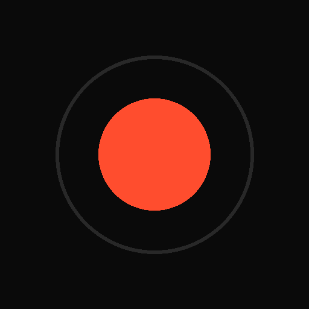

# Refraction Studio

A real-time WebGL playground for refracting bold text through procedurally generated glass geometries. Runs in any modern browser, installs as a PWA on iOS and Android.



## What it does

Type text, pick a glass geometry, watch the text refract through it in real time. Pan and zoom for closeups. Add grain or glow for finish. Snapshot a PNG or record a WEBM.

## Glass geometries

- **Random** — eight procedural pattern generators: voronoi cells, concentric ripples, multi-droplet interference, hex lens lattice, crossed moiré stripes, spirals, radial spokes, triangular lattice. Tap the button again while active to cycle to the next variant.
- **Stripes** — vertical half-cylinder columns
- **Wavy** — dense horizontal ribbed glass
- **Fluted** — vertical wedge prisms, like architectural reeded glass

## Controls

### Lens tab
- **Density** — feature count
- **Refract** — IOR strength
- **Speed** — animation rate
- **Chroma** — chromatic aberration (RGB split)
- **Rotate** — geometry rotation, with `AUTO` toggle for continuous spin. Tap the value to step in 45° increments.

### Look tab
- **Grain** — sharp monochrome film grain, regenerated every frame
- **Glow** — subtle halo around the letterforms

### Stage
- **Drag** to pan, **pinch** or **scroll** to zoom (1× to 50×), **double-tap** to recenter
- Tap the zoom readout to cycle 1× → 2× → 5×
- **Centre** button resets the view
- **Fullscreen** button (corner icon)

### Output
- **Snapshot PNG** — current frame as image
- **Record WEBM** — captures the animated canvas (desktop Chrome/Edge only; on iOS use the system screen recorder)
- **Invert** — black-on-white ↔ white-on-black

## Tech

Single HTML file. WebGL fragment shader does the refraction by computing per-fragment surface normals for each geometry, then sampling the offscreen text canvas with displaced UV coordinates. Chromatic aberration is three offset samples per fragment with slightly different IOR strengths. Glow is a 24-tap multi-ring sampling pass over the source text with golden-angle ring offsets. Grain is a per-pixel time-dithered hash.

The text is rendered to a power-of-two offscreen canvas so mipmaps work; the shader remaps UVs onto the active aspect-correct region of that texture.

## Install as a home-screen app

### iOS
1. Open the site in **Safari**
2. Tap the share button → **Add to Home Screen**
3. The icon appears on your home screen. Tap to open fullscreen, no browser chrome.

### Android
Chrome will prompt to install when you visit. Or open the menu → **Install app**.

## Local development

```bash
# any static server works
python3 -m http.server 8000
# or
npx serve
```

Then open `http://localhost:8000`.

## Files

```
index.html              # the whole app
manifest.webmanifest    # PWA manifest
icon-180.png            # iOS home-screen icon
icon-192.png            # Android home-screen icon (small)
icon-512.png            # Android home-screen icon (large) + PWA splash
```

## License

Personal project. Use freely.
